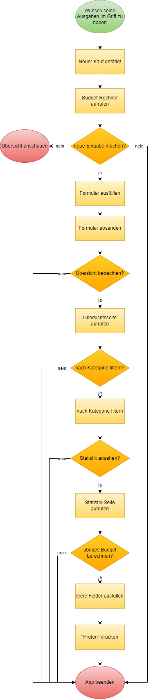
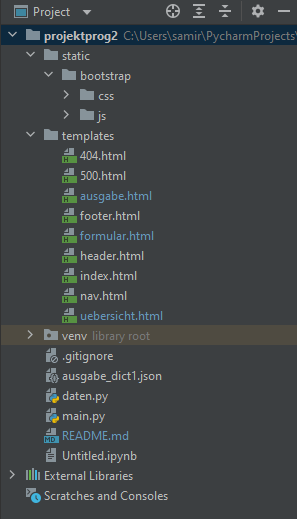

# Budget Calculator

## Inhalt
1. [Ausgangslage des Projektes](#ausgangslage-des-projektes)
2. [Funktion/Projektidee](#funktionprojektidee)
3. [Ablaufdiagramm](#ablaufdiagramm)
4. [Anleitung/Walkthrough](#anleitungwalkthrough)
5. [FAQ's](#faqs)

## Ausgangslage des Projektes
Als Student hat man es nicht immer einfach. Einerseits studiert man beispielsweise Vollzeit und versucht gleichzeitig Job, Freizeit und Sport unter einen Hut zu bringen. Um es mindestens an einem Punkt - den persönlichen Ausgaben -  ein weniger eifacher zu haben, habe ich mir überlegt einen Budget-Rechner zu programmieren. 

Dieser soll es ermöglichen, grössere oder auch kleine Beträge nach Datum, Art des Kaufs und der entsprechenden Kategorie im Griff zu haben. So dass man nach jedem Einkauf, egal ob Lebensmittel, Ausflüge, Restaurant-Besuche o.ä. eintragen kann, wie viel man ausgegeben hat und nachverfolgen kann, für was man Geld ausgegeben hat und ob es mit dem, was man maximal ausgeben möchte oder kann, übereinstimmt. 

## Funktion/Projektidee
Der Budget Calculator ist so aufgebaut, dass man direkt von der Startseite, auf die Formular-Seite wechseln kann, in welcher ein neuer Eintrag hinterlegt werden kann. 
Für einen neuen Eintrag füllt man alle Felder vom Datum bis zum letzten Feld Notiz aus. Soll ein Feld nicht ausgefüllt werden, ist es doch nötig mindestens ein Bindestrich zu hinterlegen, sodass das Programm funktioniert. 
Sind alle Daten erfasst, können diese abgespeichert werden. Abgespeichert werden diese Daten in einem Json-File, welches man in der Übersicht visualisiert betrachten kann. 

Auf den ersten Blick erscheinen alle hinterlegten Einträge - sortiert nach dem Zeitstempel des jeweiligen Eintrags -, die man wenn man möchte auch nach Kategorie filtern kann.
Ist zur gefilterten Kategorie noch kein Eintrag vorhanden, werden keine Einträge angezeigt. Sind jedoch ein oder mehrere Einträge vorhanden, werden diese Daten in einer Liste gefiltert dargestellt.

Um eine Statistik zu erhalten und zu sehen, wie viel man in welchem Monat vergleichsweise ausgegeben hat, wird auf der Statistik-Seite, ein Balkendiagramm (mittels Plotly) dargestellt. Jedoch werden hier nur die Monate angezeigt, für welche auch Einträge vorhanden sind. 
Dies kann man als Pluspunkt sehen, weil man so eine bessere Übersicht hat. Dasselbe gilt für die Totalausgaben pro Monat unterhalb des Diagramms sowie für die Berechnung des Budgets.
Auch dort können nur Monate ausgewählt werden, für die bereits Einträge vorhanden sind. 

## Ablaufdiagramm


Das oben dargestellte Ablaufdiagramm wurde zu Beginn erstellt, um einfacher zu programmieren und einer roten Linie folgen zu können.
Dieser hat sich jedoch im Laufe des Projektes verändert. Hier eine kurze Erklärung:

* Da es sich in diesem Projekt nicht um eine App, sondern eine Internetseite handelt, wurde auf die "Message", die durch das Programm hätte ausgelöst werden sollen, verzichtet.
* Ob man nur Beiträge über CHF 20.- erfassen möchte oder nicht, ist jedem selbst überlassen. Dies kommt ganz darauf an, wie fest bzw. wie genau man mit dem Budget Rechner arbeiten möchte. Deshalb wurde hierfür auch keine Funktion bzw. Berechnung programmiert.
* "Hinweis öffnen" kann ignoriert werden, da wie bereits erwähnt, es sich in diesem Projekt nicht um eine App handelt.
* Bezüglich "Budget anpassen" wurde entschieden, dass jedes Mal erneut ein Budget eingegeben werden kann, da dies sich je nach Monat verändern kann. Deshalb wird das Budget nicht gespeichert, sondern man kann das vorhandene Budget jeweils immer wieder neu berechnen. 

Das neue Ablaufdiagramm sieht nun also folgendermassen aus:



## Anleitung/Walkthrough 
### Installation / Benutzung

Damit das Programm einwandfrei funktioniert, muss in der main-Datei neben Flask auch Plotly Express installiert und importiert werden.

```
from flask import Flask
from flask import render_template
from flask import request
import daten
import plotly.express as px
from plotly.offline import plot
```

Im daten.py File müssen zwingend folgende Dinge installiert bzw. importiert werden:

```
import json
from datetime import datetime
```

### Vorhandene Funktionen
In **main.py**:
* home -> Startseite (*index.html*) wird gerendert. Bei Klick auf Button wird *formular.html* gerendert.
* page_not_found -> Bei Error 404 oder 500 wird *404.html* bzw. *500.html* gerendert.
* formular -> *formular.html* wird gerendert. Sobald das Formular ausgefüllt und abgeschickt ist, werden die eingegeben Daten in einem *Json-File* gespeichert, welches in *daten.py* programmiert wurde.
* uebersicht -> Daten von *daten.py* werden übernommen und angezeigt bzw. gefiltert bei *method = POST*. *Uebersicht.html* wird gerendert.
* statistik -> Daten von *daten.py* werden übernommen und mittels *plotly* visualisiert. Berechnungen wie "Totalausgaben" etc. wurden ebenfalls in dieser Funktion programmiert.

In **daten.py**:
* speichern -> Hier wird ein Dict erstellt, welches in ein *Json-File* geschrieben wird und die eingegeben Daten abspeichert.
* eingabe_laden -> Hier werden die Daten im *Json-File* geholt und zurückgegeben.

### Vorhandene Files

Für die Darstellung bzw. schönere Visualisierung wurde mit Boostrap (online) gearbeitet. Die Links hierzu wurden im header- sowie im footer-Template eingefügt.
Bootstrap ist zwar auch in der Datei selbst hinterlegt (offline), jedoch nicht verlinkt. Möchte das also angepasst werden, kann das ohne Problem geschehen.

**Ordnerstruktur:**



## FAQ's
1. **Was geschieht, wenn sich der Budget-Rechner über mehrere Jahre zieht bzw. über mehrere Jahre benutzt wird?**
*Dieser Budget-Rechner ist aus Programmiererfahrungsgründen sehr einfach aufgebaut. Natürlich kann man - wenn das nötige Wissen und die Erfahrung vorhanden ist - tiefer in Datenstruktur eintauchen.*
2. **Weshalb werden in der Statistik-Übersicht nicht alle Monate angezeigt?**
*Das ist Absicht. So hat man meiner Meinung nach eine bessere Übersicht, pber die Beträge, die man bereits ausgegeben hat. Es werden also nur die Monate angezeigt, für welche auch Einträge vorhanden sind.*


